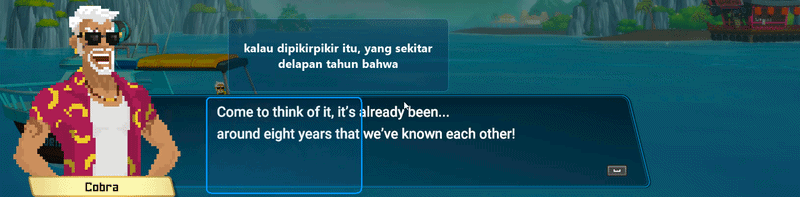

# 🎮 GameTranslator

GameTranslator adalah aplikasi penerjemah otomatis yang menerjemahkan dialog atau teks game berbahasa Inggris ke Bahasa Indonesia secara **real-time** menggunakan teknologi **OCR (Optical Character Recognition)**.

Aplikasi ini menampilkan hasil terjemahan melalui **overlay transparan**, sehingga Anda dapat memahami dialog game tanpa perlu berpindah dari permainan.

---

# 🎥 Showcase

<p align="center">
  
</p>

<p align="center">
  <em>Contoh penggunaan GameTranslator untuk menerjemahkan dialog game secara real-time.</em>
</p>

---

<p align="center">
  
</p>

<p align="center">
  <em>Showcase lain yang memperlihatkan hasil terjemahan menggunakan overlay transparan.</em>
</p>

---

# ✨ Fitur

- 🌐 Menerjemahkan teks Inggris ke Bahasa Indonesia secara otomatis.
- 🖥️ Overlay transparan yang selalu berada di atas game.
- 🖱️ Area OCR dapat dipindahkan dan diubah ukurannya.
- ⚡ OCR dan terjemahan berjalan secara real-time.
- 📖 Cache terjemahan otomatis untuk mempercepat proses.
- 📝 Debug log untuk mempermudah pencarian masalah.

---

# 📋 Persyaratan

Sebelum menjalankan aplikasi, pastikan komputer Anda telah memiliki:

- Python 3.10 atau lebih baru
- Tesseract OCR
- Koneksi internet (dibutuhkan saat pertama kali mengunduh model terjemahan)

> **Penting:** Saat menginstal Python, centang opsi **"Add Python to PATH"**.

---

# 🚀 Instalasi

## 1. Clone Repository

```bash
git clone https://github.com/lazylouyi404/GameTranslator.git
```

Atau unduh repository dalam format **ZIP** melalui GitHub.

---

## 2. Install Library Python

Buka Terminal atau PowerShell pada folder **GameTranslator**, lalu jalankan:

```bash
pip install -r requirements.txt
```

Tunggu hingga seluruh library selesai diinstal.

---

## 3. Install Tesseract OCR

Unduh Tesseract OCR melalui:

https://github.com/UB-Mannheim/tesseract/wiki

Install menggunakan lokasi default:

```text
C:\Program Files\Tesseract-OCR\
```

Apabila Anda menginstalnya di lokasi lain, ubah bagian berikut pada file `main.py`:

```python
pytesseract.pytesseract.tesseract_cmd = r"C:\Program Files\Tesseract-OCR\tesseract.exe"
```

---

# ▶️ Menjalankan Aplikasi

Jalankan game dalam **Windowed Mode** (mode jendela).

Kemudian buka Terminal pada folder **GameTranslator** dan jalankan:

```bash
python main.py
```

Setelah berhasil dijalankan:

- Overlay transparan akan muncul.
- Geser overlay ke area teks game.
- Atur ukuran overlay sesuai kebutuhan.
- GameTranslator akan membaca dan menerjemahkan teks secara otomatis.

---

# 💡 Tips

## Overlay tidak menerjemahkan

Pastikan:

- Area OCR berada tepat di atas teks game.
- Teks pada game terlihat jelas.
- Tesseract OCR telah terinstal dengan benar.

---

## Muncul Error

Periksa file:

```text
debug_log.txt
```

File tersebut berisi informasi mengenai error yang terjadi sehingga lebih mudah untuk melakukan troubleshooting.

---

## Hasil OCR Kurang Akurat

Coba beberapa hal berikut:

- Perbesar ukuran area OCR.
- Gunakan resolusi game yang lebih tinggi.
- Pastikan teks tidak tertutup objek lain.
- Hindari teks yang terlalu buram atau bergerak terlalu cepat.

---

# 📂 Struktur Project

```text
GameTranslator
│
├── images/
│   ├── demo.gif
│   └── demo2.gif
├── GameTranslator.bat
├── main.py
├── translator.py
├── overlay.py
├── capture.py
├── control.py
├── config.py
├── ocr_engine.py
├── clean_dictionary.py
├── requirements.txt
├── README.md
└── .gitignore
```

---

# ☕ Dukungan

Jika GameTranslator membantu pengalaman bermain game Anda, Anda dapat mendukung pengembangan project ini melalui Saweria.

👉 **https://saweria.co/lazylouyi404**

Setiap dukungan yang diberikan akan sangat membantu pengembangan GameTranslator ke depannya.

Terima kasih telah menggunakan **GameTranslator** ❤️

---

# ⭐ Dukung Project Ini

Apabila Anda menyukai project ini, jangan lupa memberikan **⭐ Star** pada repository GitHub agar semakin banyak orang dapat menemukan dan menggunakan project ini.

Semoga GameTranslator dapat membantu pengalaman bermain game Anda! 🎮
